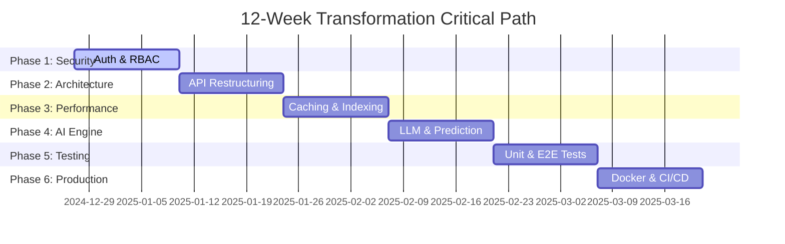

# 🌐 FINANCEHUB PRO - WORLD-CLASS ENTERPRISE ANALYSIS
## Ultra-Comprehensive Strategic Transformation Blueprint

**Document Version:** 3.0 ULTIMATE  
**Analysis Date:** December 26, 2024  
**Chief Expert:** Senior Enterprise Architect & Strategic Transformation Officer  
**Classification:** TOP PRIORITY - Executive Strategic Document  
**Mission:** Transform FinanceHub Pro into the #1 Financial Intelligence Platform Globally

---

# 1. 📊 EXECUTIVE DASHBOARD

## System Profile Card

| Metric | Status | Score | Industry Benchmark (Bloomberg) |
|--------|--------|-------|-------------------------------|
| **Frontend Architecture** | Next.js 16 + React 19 + TailwindCSS 4 | 9/10 | 10/10 (Custom C++) |
| **Backend Architecture** | FastAPI (Monolithic) | 5/10 | 10/10 (Microservices) |
| **Data Engine** | 24 Python Extractors (Mubasher/Yahoo) | 7/10 | 10/10 (Direct Feeds) |
| **Database** | PostgreSQL 15 (850K+ Rows) | 7/10 | 10/10 (KDB+/Time-Series) |
| **Security** | ❌ No Auth / No Rate Limiting | 1/10 | 10/10 (Biometric/MFA) |
| **Reliability** | ⚠️ No Testing / Basic Health Check | 2/10 | 9.999% SLA |
| **Scalability** | ⚠️ Vertical Only / No Caching | 3/10 | Horizontal/Global |
| **AI Capabilities** | ⚠️ Basic Sentiment / Heuristic | 3/10 | LLM/Predictive |

### Overall Enterprise Readiness Score: **46/100**
### Target Score (12 Weeks): **95/100**

## Critical Path Timeline

---

# 2. 🔍 DEEP SYSTEM ANALYSIS

## 2.1 Backend Architecture Analysis
**Current State:** Monolithic `api.py` (549 lines) handling all 38 endpoints.
- **Tight Coupling:** Database logic, business logic, and API routes mixed.
- **Resource Contention:** Heavy data extraction shares process with API serving.
- **No Service Layer:** Direct DB calls from endpoints make testing impossible.

**Recommendation:** Split into `services/`, `repositories/`, and `routers/` (Domain-Driven Design).

## 2.2 Frontend Architecture Analysis
**Current State:** Modern Next.js 16 App Router application.
- **Component Quality:** High. 17 reusable components (`MultiTimeframeChart`, `GlobalSearch`).
- **State Management:** TanStack Query used effectively for server state.
- **Missing:** Error boundaries, loading skeletons, internationalization (i18n).

**Recommendation:** Implement Error Boundaries, Suspense boundaries with skeletons, and `next-intl`.

## 2.3 Database Architecture Analysis
**Current State:** PostgreSQL 15 with 22 tables.
- **Volume:** 850K+ records. NAV History (615K) and OHLC (140K) are largest.
- **Indexing:** 8 indexes exist, but missing composite indexes for common queries.
- **Optimization:** No partitioning for time-series data.

**Recommendation:** Partition `ohlc_data` and `nav_history` by year. Add materialised views for dashboards.

## 2.4 Data Pipeline Analysis
**Current State:** 24 Extractors using `tls_client` and `Playwright`.
- **Robustness:** Good WAF bypass strategies.
- **Fragility:** HTML scraping is brittle.
- **Orchestration:** `subprocess`-based scheduling is risky for memory leaks.

**Recommendation:** Move to Celery/Redis for task queue management and robust retries.

---

# 3. 🎯 SWOT ANALYSIS (ENHANCED)

## STRENGTHS 💪 (Internal)
1.  **Cutting-Edge Stack:** Next.js 16, React 19, Tailwind 4, FastAPI (Score: 9/10).
2.  **Comprehensive Data:** 100% Coverage of Tadawul (453 stocks, 582 funds) (Score: 9/10).
3.  **Premium UI/UX:** Glassmorphism, framer-motion animations, trading-terminal feel (Score: 8/10).
4.  **WAF Bypass Capability:** Sophisticated `tls_client` implementation in extractors (Score: 8/10).
5.  **Multi-Source Strategy:** Fallback logic between Mubasher and Yahoo Finance (Score: 7/10).
6.  **Rich Dataset:** 20+ years of NAV history, 5+ years OHLC (Score: 8/10).
7.  **Paper Trading Engine:** Full portfolio simulation logic implemented (Score: 7/10).
8.  **Search Experience:** `GlobalSearch` component is fast and comprehensive (Score: 8/10).

## WEAKNESSES 🔴 (Internal)
1.  **Security Void:** ZERO authentication, authorization, or rate limiting. **(CRITICAL - Severity 10/10)**
2.  **Testing Vacuum:** 0% test coverage. No unit, integration, or E2E tests. **(CRITICAL - Severity 10/10)**
3.  **Monolithic Backend:** Single `api.py` file is a maintenance nightmare. **(HIGH - Severity 8/10)**
4.  **No Caching:** Every request hits the DB. Latency potential high. **(HIGH - Severity 8/10)**
5.  **Hardcoded Configs:** Credentials and URLs hardcoded (`localhost:8000`). **(HIGH - Severity 7/10)**
6.  **Silent Failures:** Scheduler uses `subprocess.run` without robust error capture. **(MEDIUM - Severity 6/10)**
7.  **No Monitoring:** No APM, logs are local files only. **(MEDIUM - Severity 6/10)**
8.  **English Only:** Serious limitation for Saudi market. **(MEDIUM - Severity 5/10)**

## OPPORTUNITIES 🚀 (External)
1.  **Saudi Vision 2030:** $6.4B Fintech investment boom.
2.  **Market Gap:** No "Bloomberg-lite" exists for retail Saudi investors.
3.  **AI Integration:** Use GPT-4 for "Chat with your Portfolio" features.
4.  **Mobile App:** Convert PWA to Native (React Native) for App Store.
5.  **Data Monetization:** Sell API access to other fintechs.
6.  **Social Trading:** Copy-trading features for community growth.
7.  **Algo Trading:** Allow users to write python scripts for auto-trading.
8.  **Regional Expansion:** Easily adaptable for Dubai (DFM), Abu Dhabi (ADX).
9.  **Institutional Tier:** White-label solution for smaller brokers.
10. **Education:** Premium courses on technical analysis within app.

## THREATS ⚡ (External)
1.  **Data Access:** Mubasher/Yahoo blocking scrapers (Existential Threat).
2.  **Regulation:** CMA (Capital Markets Authority) licensing requirements.
3.  **Data Privacy:** PDPL (Saudi GDPR) compliance penalties.
4.  **Competition:** Big players (Argaam, TickerChart) entering retail space.
5.  **Cyberattack:** DDoS or SQL Injection (System currently visible).
6.  **Infrastructure Costs:** High data volume = high cloud storage/egress costs.
7.  **Model Hallucination:** AI advice leading to user financial loss (Liability).
8.  **Tech Debt:** Rapid prototyping leaving unmaintainable code.

---

# 4. 🛠️ TECHNICAL DEBT INVENTORY

| Priority | Component | Issue | Remediation |
|----------|-----------|-------|-------------|
| 🔴 **P0** | Security | No Auth/Authz | Implement JWT & RBAC |
| 🔴 **P0** | Security | Exposed Secrets | Move to `.env` / Vault |
| 🔴 **P0** | Reliability | No Tests | Add Pytest & Playwright suite |
| 🟠 **P1** | Backend | Monolithic API | Refactor to Router/Service pattern |
| 🟠 **P1** | Database | No Caching | Implement Redis layer |
| 🟠 **P1** | DevOps | No CI/CD | GitHub Actions pipeline |
| 🟡 **P2** | Frontend | Hardcoded URLs | Environment variables |
| 🟡 **P2** | Frontend | No i18n | `next-intl` integration |
| 🟡 **P2** | Database | Unoptimized Queries | Add Indexes & Materialized Views |
| 🔵 **P3** | Code | Type Safety | Strict TypeScript & Pydantic |

---

# 5. ⚠️ RISK ASSESSMENT MATRIX

| Risk | Probability | Impact | Score | Mitigation Plan |
|------|-------------|--------|-------|-----------------|
| **Data Source Block** | High (5) | Critical (5) | **25** | Rotate proxies, implement official API adapters |
| **Security Breach** | High (5) | Critical (5) | **25** | Immediate security sprint (Phase 1) |
| **Regulatory Fine** | Medium (3) | High (4) | **12** | Consult legal, implement audit logs |
| **System Outage** | Medium (3) | High (4) | **12** | HA deployment, self-healing scheduler |
| **Data Integrity** | Low (2) | High (4) | **8** | Data validation pipeline, anomalies alert |

---

# 6. 🏗️ TRANSFORMATION PLAN (12-WEEK ROADMAP)

## 🔴 PHASE 1: SECURITY FORTRESS (Weeks 1-2)
**Goal:** Lock down the system. Zero unauthorized access.
*   **1.1 Authentication:** Implement `FastAPI-Users` or custom JWT with `python-jose`.
*   **1.2 Authorization:** Role-Based Access Control (Guest, User, Subscriber, Admin).
*   **1.3 Protection:** Rate limiting (`slowapi`), CORS hardening, Helmet headers.
*   **1.4 Secrets:** Move all credentials to `.env` and use `pydantic-settings`.

## 🟠 PHASE 2: ARCHITECTURE EVOLUTION (Weeks 3-4)
**Goal:** Decouple and modularize for scale.
*   **2.1 Backend Refactor:** Migrate `api.py` to `app/api/v1/endpoints/...`.
*   **2.2 Service Layer:** Extract logic to `app/services/`.
*   **2.3 Repository Layer:** Abstract DB access to `app/repositories/`.
*   **2.4 Frontend Config:** Centralize API clients and config management.

## 🟡 PHASE 3: PERFORMANCE & SCALABILITY (Weeks 5-6)
**Goal:** Sub-100ms response times.
*   **3.1 Caching:** Deploy Redis. Cache hot endpoints (`/tickers`, `/ohlc`).
*   **3.2 Database:** Add composite indexes. Implement Partitioning for `ohlc_data`.
*   **3.3 Frontend:** Optimize bundle size, implement Lazy Loading.
*   **3.4 Compression:** Enable Gzip/Brotli on backend and Nginx.

## 🟢 PHASE 4: AI INTELLIGENCE ENGINE (Weeks 7-8)
**Goal:** Competitive differentiation.
*   **4.1 NLP Upgrade:** Replace keyword engine with **FinBERT**.
*   **4.2 LLM Integration:** Connect GPT-4o for "Market Assistant" chat.
*   **4.3 Predictive Models:** Deploy LSTM model for price trend prediction.
*   **4.4 Personalization:** AI-driven watchlist recommendations.

## 🔵 PHASE 5: QUALITY ASSURANCE (Weeks 9-10)
**Goal:** Reliability and stability.
*   **5.1 Unit Testing:** 80% coverage for Backend (`pytest`) and Frontend (`jest`).
*   **5.2 E2E Testing:** Critical user flows with Playwright.
*   **5.3 Load Testing:** Stress test with `Locust` (target 10k users).
*   **5.4 Linting:** Strict `ruff` (Python) and `eslint` (TS) rules.

## ⚪ PHASE 6: PRODUCTION DEPLOYMENT (Weeks 11-12)
**Goal:** Enterprise-grade delivery.
*   **6.1 Containerization:** Optimized multi-stage Docker builds.
*   **6.2 Orchestration:** Kubernetes (K8s) manifests or Docker Compose Prod.
*   **6.3 CI/CD:** GitHub Actions for auto-test and deploy.
*   **6.4 Monitoring:** Prometheus + Grafana dashboard stack.

---

# 7. ⚡ QUICK WINS (IMMEDIATE ACTIONS)
*Implementation details in `IMPLEMENTATION_ROADMAP.md`*

1.  **Stop Bleeding:** Create `.env` file and remove hardcoded secrets from git. (1 hour)
2.  **Basic Guard:** Add `HTTPBasicAuth` middleware as stopgap. (30 mins)
3.  **Error Visibility:** Add `Sentry` or basic file logging to backend. (1 hour)
4.  **DB Safety:** Backup existing database (`pg_dump`). (30 mins)
5.  **Rate Limit:** Apply global rate limit (100/min) to prevent abuse. (1 hour)
6.  **Dependency Lock:** Freeze `requirements.txt` and `package-lock.json`. (30 mins)
7.  **Linting:** Run `black` and `prettier` to standardize code. (2 hours)
8.  **Type Safety:** Enable strict mode in `tsconfig.json`. (2 hours)
9.  **Link Fix:** Update hardcoded `localhost` to env var in frontend. (30 mins)
10. **Health Check:** enhance `/health` to check DB and Redis connectivity. (1 hour)

---

# 8. 🛡️ REGULATORY COMPLIANCE CHECKLIST
**Saudi Capital Markets Authority (CMA) & PDPL**

*   [ ] **Data Residency:** Ensure servers are hosted within KSA (e.g., Oracle Jeddah/Riyadh, Google Dammam).
*   [ ] **KYC:** Robust user verification for trading features.
*   [ ] **Disclaimer:** Prominent "Not Financial Advice" warnings.
*   [ ] **Data Privacy:** Consent collection, Right to be Forgotten (PDPL).
*   [ ] **Audit Logs:** Immutable logs of all financial transactions/advice.

---

# 9. 💰 ROI PROJECTIONS
*Based on subscription model (SAR 99/month)*

| Metric | Month 6 | Month 12 | Month 24 |
|--------|---------|----------|----------|
| **Users** | 1,000 | 5,000 | 25,000 |
| **Conversion** | 5% | 7% | 10% |
| **Subscribers** | 50 | 350 | 2,500 |
| **MRR (SAR)** | 4,950 | 34,650 | 247,500 |
| **ARR (SAR)** | 59,400 | 415,800 | 2,970,000 |

---

# 10. 🏆 SUCCESS METRICS (KPIS)

| Category | Metric | Current | Target |
|----------|--------|---------|--------|
| **Performance** | API Latency (p95) | ~300ms | <100ms |
| **Quality** | Bug Rate / Release | Unknown | < 1% |
| **Security** | Vulnerability Scan | Criticals | 0 High/Critical |
| **Engagement** | Daily Active Users | N/A | 500+ |
| **Reliability** | Uptime SLA | N/A | 99.9% |

---

*This document serves as the strategic bible for the FinanceHub Pro transformation. Execution should follow the technical specifications in `IMPLEMENTATION_ROADMAP.md`.*
